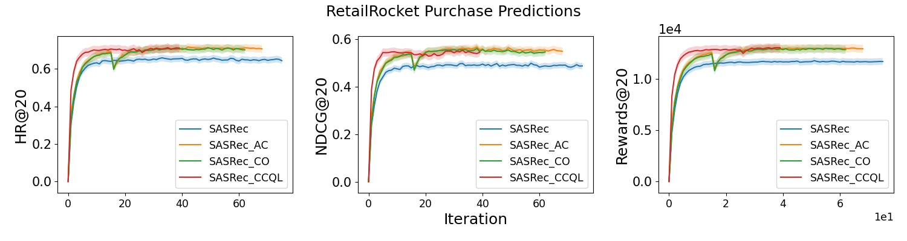

# SASRec-CCQL

Transformer + RL based Recommender System : See
paper [Robust Reinforcement Learning Objectives for Sequential Recommender Systems
](https://arxiv.org/abs/2305.18820)


## Installation

Use the `install.sh` script, give it executable permissions with `chmod +x install.sh`, and run it
with `./install.sh`. This uses `conda`.

Tested with the following lib versions:

```
python                    3.8.8
torch                     1.8.1+cu111
torch-geometric           2.2.0
torch-sparse              0.6.16
torchmetrics              0.3.2
torchvision               0.9.1+cu111
pandas                    1.5.2
numpy                     1.22.3
CUDA Version: 11.4
```

## Running Experiments

```
python SASRec_ccql.py --dataset=RC15
```

```
python SASRec_ccql.py --dataset=Retailrocket
```

# Results

## Pytorch Baselines




## Paper Results


## Citation

```
@misc{mozifian2023robust,
      title={Robust Reinforcement Learning Objectives for Sequential Recommender Systems},
      author={Melissa Mozifian and Tristan Sylvain and Dave Evans and Lili Meng},
      year={2023},
      eprint={2305.18820},
      archivePrefix={arXiv},
      primaryClass={cs.LG}
}
```